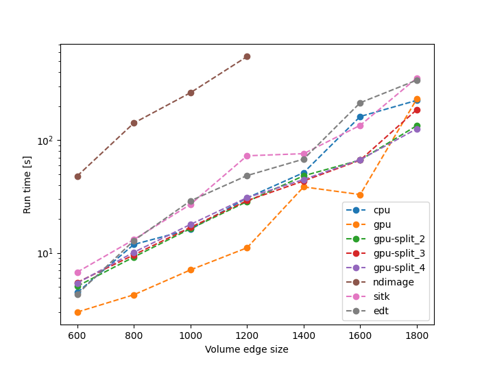

# pyedt
Python Euclidian distance transform with numba and cuda

Legend
 * cpu - PyEDT running on cpu only
 * gpu - PyEDT running with CUDA, sending the whole image to the GPU
 * gpu_split_n - PyEDT running with CUDA, the image is split in n^2 prisms and processed one at a time in the GPU
 
Benchmark executed in a Windows 10 machine, with 64 Gb of RAM, an AMD Ryzen 7 2700 CPU and a GeForce RTX 3090 Ti GPU

The methods used were developed based on modifications over the work published by Lotufo and Zampirolli[1]

[1]Lotufo, Roberto & Zampirolli, Francisco. (2001). Fast multidimensional parallel Euclidean distance transform based on mathematical morphology. 100 - 105. 10.1109/SIBGRAPI.2001.963043. 
